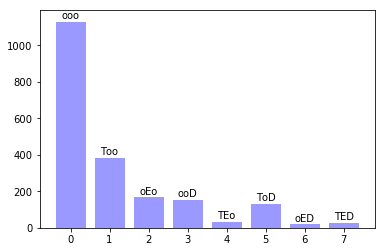

# practical 2
problem description in `practical2.md`
solved in TensorFlow

## how to use glove word vectors
* download e.g. the 6b (trained on 6 billion words of text) vectors from here: [http://nlp.stanford.edu/data/glove.6B.zip](http://nlp.stanford.edu/data/glove.6B.zip)
* to import them via `gensim.models.KeyedVectors` (like I do in the notebook) you have to first convert them to a compatible format via:  
`python -m gensim.scripts.glove2word2vec --input glove.6B.60d.txt --output glove.6B.50d.w2vformat.txt`

## questions

1. influence of word embeddings (random init + train) vs. (glove init + train) vs. (glove init + fixed)?
* embeddings initialized with glove vectors and backpropagating into them was found to be the best variant with ~67% accuracy on the test set
* worst performance was random init and no backprop into the embeddings, this basically failed to learn anything which makes it clear that proper embeddings are very important for making sense out of text

2. performance for alternative activations (sigmoid, relu)?
* for the same parameters (hidden\_units, dropout, etc.) the performance was actually tied between all three
* since the network is quite shallow it doesn't seem to play a big role in terms of vanishing or dying gradients so all three performed equally well (or bad if you look at the performance)

3. what happens when you add dropout?
* dropout helps in reducing overfitting, the performance gap between the training and cv/test accuracy is now lower (~10%) which indicates a model that would be more able to generalize to new data

4. hidden layer size variation?
* does not seem to play a huge role if you start out on reasonable values
* since the embedding layer has a dimension of 50, the number of hidden units was also chosen to be 50 with the reasoning that it should at least be able to express the same information content as the embeddings
* much more than 50 didn't show significant differences in performance

5. what to change for adding a second hidden layer?
* to add a second hidden layer in tensorflow is straightforward by simply defining two new variables (new weight and new bias) and copying the first hidden layer (linear transform -> activation)
* since 2 layers are still not really "deep" this should work with the same hyperparameters, however when adding even more layers one would have to take care of possible vanishing gradient issues

6. training algo influence?
* adam showed the best performance, however standard sgd was basically the same
* at first I thought it might be worth trying adagrad that might train better by being able to apply higher gradients into the word embeddings but it didn't turn out to be all that different to adam or sgd

7. graph is at the end of the notebook
* it seems like the weight embeddings for many of the labels that we failed to learn are lumped close together and also very close to the graph origin
* this indicates that we haven't really learned much about them and therefore fail to predict them

## some insights

* all texts were padded with a special token ('\<PAD\>') such that each sentence had exactly the length of the longest text in the dataset, this was important to get batching to work

* as a sanity check it is worth thinking about the expected cross-entropy loss for a totally random model...since it is basically -log(yhat\_max) for a one-hot ground truth vector, the expected value for 8 classes is -log(1/8) ~ 2.1 (so you should converge towards something significantly lower than that)

* doing some more elaborate preprocessing (removing most frequent and least frequent words from the texts) really helps (i.e. removing noise) also because this removes a lot of the words that we didn't have a pretrained glove vector for

* plotting the label predictions and the ground truth on the test set on top of each other makes it clear that there simply doesn't seem to be enough data for some of the labels

* the overall dataset is dominated by 50% of the label 'ooo' (neither T nor E nor D) with some labels only having around ~20 datapoints overall so there is really not much to learn from for our network and it is not surprising that it is very hard to predict especially those rare labels  

